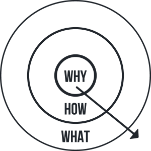

  

Jag läste nyligen &#8220;Start With Why&#8221; av Simon Sinek, där han ger sig på frågan &#8220;Varför gör vi det vi gör?&#8221;. Han anser att fler bör börja med &#8220;Varför&#8221;.

I sin bok &#8220;Start With Why&#8221;, tar Sinek fram varför vissa människor och organisationer är mer innovativa, mer inflytelserika och mer lönsamma än andra. Han belyser varför vissa människor och organisationer lyckas få större lojalitet från sina kunder och anställda.

Sinek bygger på en rad verkliga berättelser, vävda samman till en klar bild av vad som verkligen krävs för att leda och inspirera andra. I observation och studier av ledare med största globala inflytande, upptäckte Simon Sinek att de alla har något gemensamt. De alla tänker, agerar och kommunicerar på exakt samma sätt. Detta är i stark kontrast till vad de flesta andra människor gör.

Simon kallar denna kraftfulla idé &#8220;The Golden Circle&#8221;. Det ger en plan på vilka organisationer kan byggas, kan rörelser ledas och människor kan inspireras. Det hela börjar med &#8220;varför&#8221;. 

Poängen till Simon filosofi är att varje organisation kan förklara vad den gör. Vissa kan förklara hur de gör det, men väldigt få kan definitivt formulera varför.

Begreppet &#8220;The Golden Circle&#8221; är inspirerad av det gyllene snittet, en enkel matematisk relation som har förvånat matematiker, biologer, arkitekter, konstnärer, musiker och naturister sedan början av vår tid.

De flesta människor börjar från utsidan av cirkeln &#8220;WHAT(Vad)&#8221; och för att sedan arbeta mot mitten till &#8220;WHY(Varför)&#8221;. Sinek visar dock hur stora ledare som inspirerar stora insatser arbetar från insidan av cirkeln börjar med deras &#8220;Varför&#8221; och sedan strålar ut till &#8220;Vad&#8221;.

Att förstå hur detta enkla diagram fungerar är nyckeln till att veta varför du gör det du gör. Att ha en tydlig känsla av &#8220;varför&#8221; är det enda sättet att upprätthålla varaktig framgång och en större sammanslagning av innovation och flexibilitet. När din &#8220;varför&#8221; blir suddig, blir det svårare att upprätthålla tillväxt, lojalitet och inspiration som stimulerar de inledande framgångarna. 

Sinek informerar sina läsare att de som börjar med &#8220;varför&#8221; aldrig manipulerar, de inspirerar. Människor följer sanna ledare inte för att de måste &#8211; de följer eftersom de vill.

**En rad frågor öppnas upp till läsaren som: **

- Varför finns din organisation? 

- Varför göra det den gör? 

- Varför köper kunderna verkligen från ett företag eller en annan? 

- Varför är människor lojala mot vissa ledare, men inte andra. 

Att börja med &#8220;Varför&#8221; är viktigt vare sig man är en entreprenör, en person i ett stort eller litet företag. Eller vare sig om det är icke-vinstdrivande eller politiskt.

**Orkar du inte läsa boken?**

Simon har även föreläst om detta fenomen hos TED. Men jag rekommenderar fortfarande att ni läser boken!
