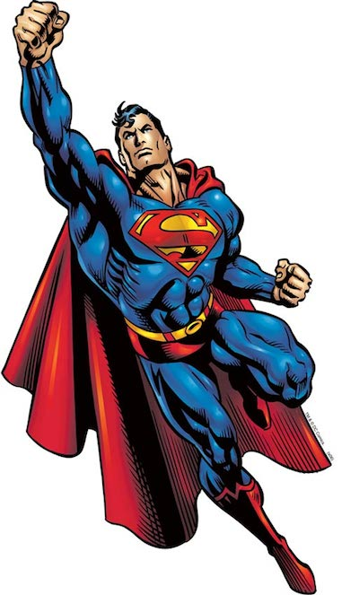

Jag vet att det verkar som varje webbdesigner eller entreprenör du följer kan designa ett vackert UI, koda fram det över en helg, eller är delaktig i startup efter startup och fortfarande har energi till att arbeta på ett sidoprojekt fram till 04:00. Sedan även göra en podcast om upplevelsen nästa dag. Nyckelorden här är _"det verkar som"_. Det kan de inte. De ljuger för dig.

Allt detta prat om gurus och rockstjärnor har gjort oss alla till skrytmånsar, vi låtsas som att vi kan göra vad som helst. Att vi **måste** kunna göra allt. Det räcker inte att verkligen jobba sig till att bli en begåvad, mångdimensionell designer, du måste lära dig att koda också. Det räcker heller inte att du har en massa idéer till startups för att kunna kalla dig entreprenör, du måste kunna driva och leda ett företag också.

Att ha ett 9-5 jobb för att försörja din familj? Lame. Frilans är rätt väg att gå. Arbeta med stora kunder och ha fortfarande tid att lägga på twitter och dribbble. Så kan du säkert hitta ett sidoprojekt som du kan sysselsätta dig med från från 19-midnatt.

Nej, stopp.

Jag säger inte att något av detta tillvägagångsätten är rätt eller fel. Jag tycker bara det är konstigt att vi har detta medfödda tryck att vi måste göra allt på en gång (och vara fantastiska på det). Du ska inte behöva jobba ihjäl dig i ett projekt om du inte kan visa samma passion vid lansering.

I den här branschen finns det ett stort talesätt som lyder "Fuck it. Ship it!". Lansera bara! Jag kan inte räkna på fingrarna över hur många projekt jag har sett presenterats men att de ändå aldrig fått se dagens ljus. Det är troligt att någon kände trycket att de bara var tvungna att släppa något när de i själva verket inte hade tid, energi, pengar, erfarenhet, kompetens, ja att vad som helst - för att verkligen lyckas. Och till dessa människor, jag vill att ni ska veta att det är okej. Du måste inte vara [den största designern i världen][1]. Men om det nu är ditt mål, så kommer jag inte förhindra dig. Kom bara ihåg att det tar väldigt lång tid och en hel del uppoffringar för att bli det.

Du är förmodligen riktigt riktigt duktig på det du gör och du brinner för att bli bättre. Men ditt företag eller dina kunder behöver inte stålmannen, de bara behöver dig. Du är redan mycket bättre än vad alternativet är.

Bara för att du inte är till synes gör allt, så betyder inte det att du är inte är någon.

[1]: http://www.apple.com/pr/bios/jonathan-ive.html
