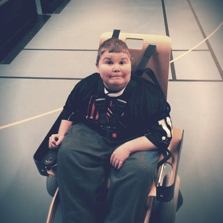

--- 
published: true
title: När ett stort hjärta inte orkar längre
layout: post
permalink: nar-ett-stort-hjarta-inte-orkar-langre
---

Jag är ganska fåordig just nu. Det enda jag känner är sorg och kärlek. Det är fortfarande svårt att förstå. Känslorna har inte hunnit ikapp. Vi lirade Elhockey ihop förra helgen och tog silver. Och nu är du borta? Hur hanterar man det? Hur ska man ens kunna prata om tomrummet som blivit och alltid kommer att finnas kvar? Jag har ännu inte förstått hur det kan gå så fort.

**Daniel Nygård Johnsson** — en kär vän lämnade oss i natt efter att hans stora hjärta inte orkade längre. Vid frukostbordet fick vi samtalet från din far att du åkt in med andningsvårigheter igår Söndag. Du hamnade genast på intensiven men det blev bara värre och värre, sen efter 5 återupplivningsförsök så orkade inte ditt hjärta längre. 

Att förklara hur det är att leva med Duchennes Muskeldystrofi eller SMA för någon som inte gör det är i princip omöjligt. Men man påminns ofta hur skört livet verkligen är. Det kommer ta ett tag att komma tillbaka i vardagen, men du kommer alltid leva vidare inom oss genom minnena.

Vi kommer alla minnas ditt skratt, ditt leende och det ljus du fyllde varje rum. Tack för alla fantastiska minnen. Tack för alla roliga Elhockeymatcher. Tack för allt!

✝ <strong>Daniel Nygård Johnsson</strong> 10 Aug 1993 - 19 Maj 2014

<iframe src="https://embed.spotify.com/?uri=spotify:track:2GttMH50LmV8VtZaz4d1EL" width="100%" height="80" frameborder="0" allowtransparency="true"></iframe>
